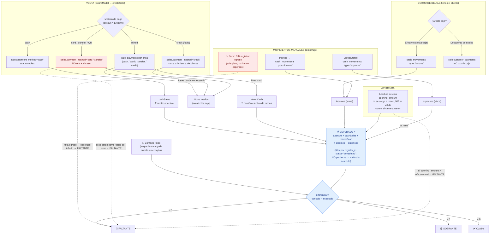

# Cierre de Caja / Arqueo — Cómo funciona y por qué puede no cuadrar

> Documento de diagnóstico (2026-06-24). Analiza el caso "la encargada hace el
> cierre y al sistema le sale un **faltante de 400.000**, pero contando a mano le
> sale **~55.000**, y hay una venta de **~50.000** que explicaría el faltante real".
> Incluye el flujo completo (ventas → caja → cierre), los escenarios que producen
> descuadre, y una checklist de diagnóstico con SQL.
>
> _Nota: el resto de `docs/` está en inglés; este queda en español porque es
> material de soporte para el cliente. Puedo traducirlo si se va a versionar como
> doc canónico._

---

## 1. La fórmula del arqueo (verificada en el código)

El **efectivo esperado** se calcula en el servidor en
[`closeCashRegister`](../src/main/db/queries/cash.ts#L138-L144):

```
esperado = apertura
         + ventas_efectivo        ← SUM(sales.total)         WHERE payment_method='cash'
         + efectivo_de_mixtas     ← SUM(sale_payments.amount) WHERE method='cash' y la venta es 'mixed'
         + ingresos_manuales      ← SUM(cash_movements.amount) type='income'   (vivos)
         − egresos_manuales       ← SUM(cash_movements.amount) type='expense'  (vivos)

diferencia = contado_físico − esperado
   diferencia < 0  →  FALTANTE   (falta plata respecto a lo que el sistema espera)
   diferencia > 0  →  SOBRANTE
```

Tres aclaraciones que **importan para entender los descuadres**:

1. **Las ventas NO pasan por `cash_movements`.** Hay **tres fuentes separadas** que
   alimentan el esperado: las ventas en efectivo (`sales`), la porción efectivo de
   las mixtas (`sale_payments`) y los movimientos manuales (`cash_movements`).
2. **Los cobros de deuda en efectivo** ("Registrar pago → Efectivo (afecta caja)")
   insertan un `cash_movements` type `income`
   ([`customers.ts:158`](../src/main/db/queries/customers.ts#L158-L166)) → suman al
   esperado **sin ser una venta**. El conteo manual casi siempre se olvida de ellos.
3. **Todo se filtra por `register_id`, NO por fecha.** Si la caja quedó abierta
   varios días, el esperado **acumula el efectivo de todos esos días**, no solo el de hoy.

La fórmula en sí es **correcta**. Los descuadres nacen de los **datos de entrada**
(qué se carga y cómo), no de la aritmética del cierre.

---

## 2. Diagrama del flujo (ventas → caja → cierre)



### Anulación de venta (cómo afecta el arqueo)

Al anular una venta con efectivo **en una caja abierta**, el sistema marca la venta
`cancelled` (sale del `cashSales`) **e inserta un par neto** `income` + `expense`
por la porción efectivo → efecto neto **cero** en el esperado, con rastro auditable
([`cancelSale`](../src/main/db/queries/sales.ts#L390-L514)). Anular una venta con
efectivo en una caja **ya cerrada está bloqueado**. Este mecanismo está **bien
implementado** (verificado); el riesgo está si alguien anula **una sola pata** del
par desde "Movimientos de Caja" (ver escenario C-3).

---

## 3. Escenarios que producen el descuadre — rankeados para tu caso

El dato clave: **el sistema reporta ~345.000 MÁS de faltante que el conteo manual**
(400k vs 55k). La venta de ~50k explica el faltante **real**. Hay que explicar el
**gap de ~345k que solo ve el sistema** → la causa está en un término del *esperado*
que se infló, no en el conteo físico.

> **Regla de oro:** el primer término que arroje un monto **≈ 345.000** es la causa raíz.

### 🅰 Tier A — Explican ~345k con un solo evento (más probables)

| # | Escenario | Mecanismo | Cómo confirmarlo |
|---|-----------|-----------|------------------|
| **A1** | **Apertura inflada** | `opening_amount` se cargó alto (p.ej. "ayer cerró 400k") pero el cajón arrancó vacío porque alguien se llevó el efectivo y no se repuso. El faltante = apertura fantasma. **Encaja casi perfecto** (~400k apertura + 55k venta). | Comparar `opening_amount` de la caja con el `closing_amount` del cierre anterior (Paso 1). |
| **A2** | **Movimiento manual mal cargado (signo/monto)** | Un **egreso de 200k cargado como ingreso** desvía el esperado **2× = 400k**. O un ingreso con un dígito de más (400k en vez de 40k). Invisible en reportes de ventas. | Listar `cash_movements` income/expense ordenados por monto (Paso 2). |
| **A3** | **Retiro/sangría sin registrar egreso** | Se sacó plata del cajón (depósito, pago a proveedor, retiro del dueño) **sin** cargar un egreso → el efectivo físico bajó pero el esperado no. Faltante = suma de retiros no registrados. Causa estructural #1 en mostrador. | Cruzar egresos registrados contra los comprobantes/retiros físicos del día (Paso 2). |

### 🅱 Tier B — Explican el gap pero requieren acumulación / multi-día (probables)

| # | Escenario | Mecanismo |
|---|-----------|-----------|
| **B4** | **Caja abierta varios días** | El cierre **no filtra por fecha**: `cashSales` acumula el efectivo de todos los días desde la apertura. Si no se cerró a diario y el efectivo de días previos se retiró sin egreso, el esperado queda inflado. La encargada cuenta solo HOY → faltante enorme. |
| **B5** | **Cobros de deuda en efectivo** | Cada pago con "afecta caja" mete un `income`. Si (a) era descuento de sueldo mal tipado, (b) la plata no entró físicamente, o (c) la encargada no los suma a mano, el sistema espera ~345k de más. Plausible en carnicería con fiado. |
| **B6** | **Ventas de otro cajero en la caja única** | Solo puede haber **una** caja abierta global. Si un segundo operador vendió efectivo mientras la caja abierta era la de la encargada, esas ventas suben SU esperado pero la plata está en otro lado. |

### 🅲 Tier C — Aportan ~50k, no 400k por sí solos (parciales)

- **C1 — Venta no-efectivo tipeada como Efectivo.** El sistema **nunca valida** que el
  método cargado sea el cobro real ([`createSale`](../src/main/db/queries/sales.ts#L64),
  [`CobroModal`](../src/renderer/src/modules/ventas/CobroModal.tsx#L64) arranca en "Efectivo").
  Una transferencia/QR de ~50k dejada como "cash" infla el esperado por su total →
  **faltante fantasma = 50k**. Necesitarías ~8 para llegar a 400k, pero explica el
  slice de la venta de 50k que encontraron.
- **C2 — Mixto con porción cash mal asignada.** Solo se valida `Σ porciones = total`,
  no que la línea efectivo sea el efectivo real → descuadre por la sub-asignación,
  con el total de la venta cuadrando (por eso pasa desapercibido).
- **C3 — Anular una sola pata del par income/expense** de una anulación desde
  "Movimientos de Caja" → faltante/sobrante espurio = porción cash de esa venta.

### 🅳 Tier D — No es un faltante real, es confusión al conciliar

- **D1 — Comparar contra el número equivocado.** El **Listado de Ventas** filtra una
  mixta como "mixto" y **no reparte su efectivo**, mientras el cierre **sí** cuenta esa
  porción. Si la encargada suma "ventas efectivo" de una pantalla que usa otra fórmula
  (o suma el "Total recaudado" de todos los métodos, o ignora la apertura/ingresos),
  los números no coinciden aunque la caja esté bien.

### ⛔ Descartados (verificados como NO-causa de un faltante de 400k)
Producen **sobrante** (signo inverso): venta efectivo tipeada como transferencia,
anular sin devolver físicamente. **Refutados**: el par neto de anulación (está bien),
el re-fetch del esperado, atribución por caché. La fórmula del cierre y el manejo de
anulaciones **no tienen bug** que infle el faltante.

---

## 4. Checklist de diagnóstico (corré en orden — minutos)

Reemplazá `:RID` por el `id` de la caja del cierre con faltante.

**Paso 0 — Identificar la caja:**
```sql
SELECT id, user_id, opened_at, closed_at,
       opening_amount, expected_amount, closing_amount, difference, status
FROM cash_registers
WHERE difference < 0
ORDER BY closed_at DESC
LIMIT 5;
```
¿`difference ≈ -400000`? ¿`opened_at` vs `closed_at` difieren en >1 día? ¿`opening_amount` grande?

**Paso 1 — (A1) ¿Apertura inflada?**
```sql
SELECT id, opening_amount, closing_amount, closed_at
FROM cash_registers
WHERE status='closed'
  AND closed_at < (SELECT opened_at FROM cash_registers WHERE id=:RID)
ORDER BY closed_at DESC LIMIT 1;
```
Si el `opening_amount` de :RID ≫ el `closing_amount` previo (o no hubo reposición) → **apertura fantasma**.

**Paso 2 — (A2/A3) Movimientos manuales — el sospechoso de 400k/200k:**
```sql
SELECT id, type, amount, description, user_id, created_at
FROM cash_movements
WHERE register_id=:RID AND type IN ('income','expense')
  AND NOT EXISTS (SELECT 1 FROM cash_movements v WHERE v.void_of = cash_movements.id)
ORDER BY amount DESC;
```
Buscá: un income de ~400k/~200k que fue en realidad un retiro; un monto con un dígito de más; o **falta** un egreso por un retiro que la encargada confirma.

**Paso 3 — (B4) ¿Caja multi-día?**
```sql
SELECT date(created_at) d, payment_method, SUM(total) total_dia
FROM sales
WHERE register_id=:RID AND status='completed'
GROUP BY d, payment_method ORDER BY d;
```
Ventas en varias fechas → el esperado incluye efectivo de días previos ya retirado.

**Paso 4 — Recomponer el esperado y aislar el término culpable:**
```sql
-- cashSales
SELECT COALESCE(SUM(total),0) AS cashSales FROM sales
 WHERE register_id=:RID AND payment_method='cash' AND status='completed';
-- mixedCash
SELECT COALESCE(SUM(sp.amount),0) AS mixedCash FROM sale_payments sp
 JOIN sales s ON s.id=sp.sale_id
 WHERE s.register_id=:RID AND sp.method='cash' AND s.payment_method='mixed' AND s.status='completed';
-- incomes / expenses (vivos)
SELECT type, COALESCE(SUM(amount),0) FROM cash_movements
 WHERE register_id=:RID AND type IN ('income','expense')
   AND NOT EXISTS (SELECT 1 FROM cash_movements v WHERE v.void_of=cash_movements.id)
 GROUP BY type;
```
Calculá `apertura + cashSales + mixedCash + incomes − expenses` y compará con el
`expected_amount` guardado (deben coincidir → la fórmula está bien; el problema está
en los **inputs**). Mirá qué término aporta los ~345k de más.

**Paso 5 — (B5) Cobros de deuda en efectivo:**
```sql
SELECT cm.id, cm.amount, cm.description, cm.created_at, cp.affects_cash, c.is_employee
FROM cash_movements cm
LEFT JOIN customer_payments cp ON cp.cash_movement_id = cm.id
LEFT JOIN customers c ON c.id = cp.customer_id
WHERE cm.register_id=:RID AND cm.type='income'
  AND cm.description LIKE 'Pago de deuda%'
  AND NOT EXISTS (SELECT 1 FROM cash_movements v WHERE v.void_of=cm.id);
```
Si suman ≈ 345k (o son empleados con "descuento de sueldo" mal marcado como efectivo) → ahí está.

**Paso 6 — (B6) ¿Ventas de otro cajero?**
```sql
SELECT user_id, COUNT(*), SUM(total) FROM sales
WHERE register_id=:RID AND payment_method='cash' AND status='completed'
GROUP BY user_id;
```

**Paso 7 — (Tier C) Anomalías de pagos / pares de anulación rotos:**
```sql
SELECT * FROM sale_payments WHERE amount <= 0;
SELECT cm.id, cm.type, cm.amount, cm.description,
       EXISTS(SELECT 1 FROM cash_movements v WHERE v.void_of=cm.id) AS anulado
FROM cash_movements cm
WHERE cm.register_id=:RID AND cm.description LIKE 'Anulación venta #%'
ORDER BY cm.id;
```
Cada anulación debe tener su par income+expense con el **mismo** estado de anulado.

---

## 5. Recomendaciones (por impacto)

**Proceso (inmediato, sin deploy):**
1. Registrar **todo** retiro/depósito como egreso **antes** de sacar plata del cajón.
2. **Cerrar la caja a diario** — no dejarla abierta multi-día.
3. La **apertura = efectivo realmente contado**, no "lo que cerró ayer"; el retiro del dueño va como egreso.
4. Capacitar en ingreso vs egreso y en marcar "Descuento de sueldo (no afecta caja)".

**UX (alto impacto, bajo costo):**
5. En **CierreCajaPage**, desglosar el "Efectivo esperado" en sus términos
   (Apertura + Ventas efectivo + Cobros de deuda + Otros ingresos − Egresos). Hoy es
   un número opaco e imposible de reconciliar a mano.
6. En la apertura, **sugerir/validar** `opening_amount` contra el `closing_amount` del cierre anterior.
7. En el Listado de Ventas, aclarar el footer ("Total — todos los métodos") y agregar un subtotal **solo efectivo**.

**Código (hardening):**
8. `voidMovement`: impedir anular **una sola pata** de un par de anulación.
9. `createSale`: validar `amount >= 0` por línea y rechazar `payments` en ventas no-mixtas (+ `CHECK(amount >= 0)` en `sale_payments`).
10. `createSale`: derivar `userId` de `ctx.userId`, no del payload (atribución correcta de cajero).
11. `closeCashRegister`: en cierre con retraso, mostrar el desglose por día del esperado acumulado.

---

_Análisis generado con auditoría multi-agente sobre el código real
(`src/main/db/queries/cash.ts`, `sales.ts`, `cash-movements.ts`, `customers.ts`,
`reports.ts` y la UI de caja/ventas)._
