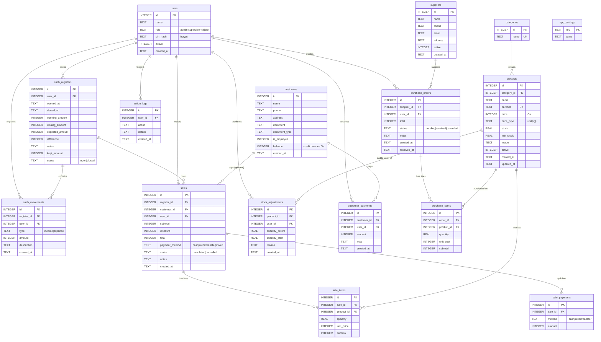

# Database — Schema & Relationships

Full schema of the local **Multicarnes POS** database.

- Engine: **SQLite 3** (via `better-sqlite3`).
- Location: `app.getPath('userData')/pos.db` — created automatically on first launch.
- Access: **main process only**. The renderer never queries the DB directly; everything goes through IPC (`module:action`).
- Sale and purchase operations are wrapped in transactions (`db.transaction(...)`) to keep stock and cash consistent.
- Canonical schema definition: [src/main/db/schema.ts](../src/main/db/schema.ts).
- Initial data (seed): [src/main/db/seed.ts](../src/main/db/seed.ts).

## Conventions

- **Identifiers**: every table uses `id INTEGER PRIMARY KEY AUTOINCREMENT`.
- **Currency**: guaraníes (Gs.) as `INTEGER` — no decimals.
- **Quantities**: `REAL` for products that can be sold by kg; logical integers for units.
- **Dates**: `TEXT` with default `datetime('now','localtime')` (local ISO, not UTC).
- **Booleans**: `INTEGER` (`0` / `1`).
- **Foreign keys**: declared with `REFERENCES` but **`PRAGMA foreign_keys` is not enabled** — integrity is enforced at the application level inside transactions.

## ER Diagram

## Tables

### `users`

System operators. Authentication is done via a numeric **PIN** hashed with bcrypt.

| Column       | Type       | Notes                               |
| ------------ | ---------- | ----------------------------------- |
| `id`         | INTEGER PK | Auto-increment                      |
| `name`       | TEXT       | Display name                        |
| `role`       | TEXT       | `admin` \| `supervisor` \| `cajero` |
| `pin_hash`   | TEXT       | bcrypt of the numeric PIN           |
| `active`     | INTEGER    | `1` enabled, `0` disabled           |
| `created_at` | TEXT       | Local ISO                           |

**Seed**: `Administrador` user (role `admin`, PIN `123456`).

### `categories`

Product grouping. Name is unique.

**Seed**: `Vacuno`, `Cerdo`, `Pollo`, `Embutidos`, `Otros`.

### `products`

Catalog. `price_type` controls how the quantity is billed (`unit`, `kg`, etc.).

| Column               | Type                         | Notes                                             |
| -------------------- | ---------------------------- | ------------------------------------------------- |
| `category_id`        | INTEGER FK → `categories.id` | Optional                                          |
| `barcode`            | TEXT UNIQUE                  | Scanner input                                     |
| `price`              | INTEGER                      | Gs. per unit or per kg, depending on `price_type` |
| `stock`, `min_stock` | REAL                         | Allows fractions (kg)                             |
| `image`              | TEXT                         | Filename served via the `product-img://` protocol |

### `customers`

POS customers. Support **store credit** (`balance` positive = customer owes the store).

- `is_employee = 1` flags employees (typically with different credit handling).
- `balance` is updated inside the sale transaction when there is a `credit` payment leg, and decreased when a `customer_payments` row is recorded.

### `suppliers`

Suppliers linked to `purchase_orders`.

### `cash_registers`

Each cash-register opening creates a row with `status='open'`. Closing flips it to `closed`, fills `closing_amount`, `expected_amount` (computed from movements + cash sales), and `difference`.

Only **one open register per user** at a time (enforced at the application level).

`kept_amount` (migration v18, feature 010) is the cash left in the drawer at close — the float for the next shift.

- `NULL` for every register closed before that release; the read side renders it as "—" rather than guessing.
- The amount handed over is derived as `closing_amount − kept_amount` and never stored.
- It does **not** create a `cash_movements` row: the synthetic `closing` movement still carries the full counted cash, so the arqueo (`expected_amount` / `difference`) is untouched by the float.

### `cash_movements`

Manual cash income and expense entries during a shift (not sales or purchases). Type `income` or `expense`.

### `sales`

Sale header. `total = subtotal − discount`.

- `payment_method`:
  - `cash` — single cash payment.
  - `credit` — store credit (fiado), adds to `customers.balance`.
  - `transfer` — bank transfer.
  - `mixed` — combination of methods; the breakdown lives in `sale_payments`.
- `status='cancelled'` reverses stock (handled in main, not via CASCADE).

### `sale_items`

Sale lines. `subtotal = quantity * unit_price`. Stock for the product is updated in the same transaction as the insert.

### `sale_payments`

Used when `payment_method='mixed'` (or as a per-method breakdown for any sale). The sum of `amount` must equal `sales.total`.

### `purchase_orders`

Purchase orders to suppliers. `status='received'` applies stock-in and updates `received_at`.

### `purchase_items`

Order lines. `unit_cost` feeds cost history (it does not affect `products.price`).

### `stock_adjustments`

**Audit log** of manual stock changes (shrinkage, recounts, corrections). Stores before/after values and a reason. The actual change to `products.stock` happens in the same transaction.

### `customer_payments`

Payments a customer makes to reduce their `balance` (credit settlement).

### `action_logs`

Free-form log for sensitive actions (logins, backup restores, etc.). `details` may be serialized JSON.

### `app_settings`

Key/value configuration. Currently used keys:

| Key                       | Default                 | Description                                            |
| ------------------------- | ----------------------- | ------------------------------------------------------ |
| `business_name`           | `Multicarnes S.R.L.`    | Business name (printed on receipts)                    |
| `business_address`        | `Encarnación, Paraguay` | Address                                                |
| `business_phone`          | ``                      | Phone                                                  |
| `thermal_printer_name`    | ``                      | Thermal printer name                                   |
| `thermal_printer_width`   | `80`                    | `58` or `80` mm                                        |
| `backup_path`             | ``                      | Backup destination folder (empty = `userData/backups`) |
| `auto_backup`             | `1`                     | If `1`, creates an automatic backup on cash close      |
| `backup_schedule_enabled` | `0`                     | If `1`, enables the scheduled daily backup             |
| `backup_schedule_time`    | `22:00`                 | Scheduled backup time (24h format)                     |

## Typical transactional flow (sale)

1. Validate that the cashier has an open register.
2. `BEGIN TRANSACTION`
   1. `INSERT INTO sales`.
   2. For each line: `INSERT INTO sale_items` + `UPDATE products.stock`.
   3. If `payment_method='mixed'` → `INSERT INTO sale_payments` (one per method).
   4. If there is a `credit` leg → `UPDATE customers.balance`.
3. `COMMIT` (or automatic rollback if any step fails).

The same pattern applies to purchase reception (`purchase_orders.status='received'`) and stock adjustments.

## Migrations

The schema is currently applied with `CREATE TABLE IF NOT EXISTS` on every startup (see [schema.ts](../src/main/db/schema.ts)). There is no formal migration system — destructive changes require a manual script or a backup + restore.
