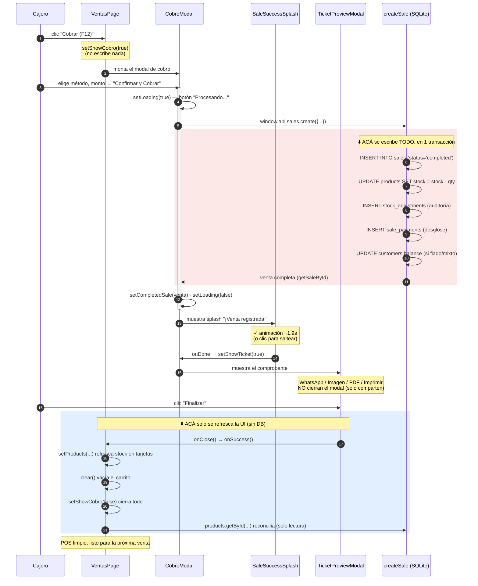
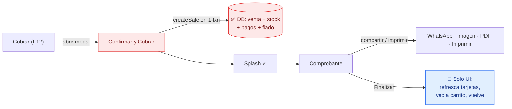

# Flujo de cobro y comprobante — qué hace cada botón y cuándo se escribe en la DB

> Documento de soporte (2026-06-26). Responde la duda: _"¿por qué el stock se
> descuenta al dar **Finalizar** y no antes?"_. Mapea el flujo completo desde el
> carrito hasta volver al POS, marcando **dónde se escribe en la base de datos**
> (autoritativo) vs. **dónde solo se refresca la pantalla** (optimista).
>
> _Nota: queda en español por ser material de soporte; el resto de `docs/` está en
> inglés. Hermano de [`ventas-registro-prematuro-analisis.md`](./ventas-registro-prematuro-analisis.md)
> y [`cierre-de-caja-analisis.md`](./cierre-de-caja-analisis.md)._

---

## TL;DR — la respuesta directa

**El descuento REAL de stock (y todo el registro de la venta) ocurre al apretar
"Confirmar y Cobrar", NO al apretar "Finalizar".**

- En **"Confirmar y Cobrar"** se llama a `createSale`, que dentro de **una sola
  transacción SQLite** inserta la venta, descuenta el stock, registra los pagos y
  debita el fiado. Cuando el splash "¡Venta registrada!" aparece, **ya está todo
  guardado y es irreversible salvo anulación**.
- **"Finalizar"** NO toca la base de datos. Solo: (1) refresca el número de stock
  en las tarjetas de producto en pantalla, (2) vacía el carrito y (3) cierra el
  comprobante para dejar el POS listo para la próxima venta.

Por eso "parece" que descuenta al final: lo que se mueve visualmente al dar
Finalizar es el **refresco de las tarjetas**, que estaban tapadas por el modal.
El número en la DB ya había bajado un par de segundos antes.

> 🔒 **Si cerrás la app entre "Confirmar y Cobrar" y "Finalizar", la venta NO se
> pierde.** Ya está commiteada. Al reabrir, el stock ya está descontado y la venta
> aparece en el historial. Finalizar es solo "limpiar la pantalla".

---

## Gráfico — secuencia del camino feliz (venta en efectivo)

---

## Qué hace cada botón

| Botón | Dónde | Qué dispara | ¿Escribe en DB? |
|---|---|---|:---:|
| **Cobrar (F12)** | Carrito | `setShowCobro(true)` → abre `CobroModal` | ❌ No |
| **Suspender (F9)** | Carrito | Guarda el ticket en "Pendientes" (estado local) y vacía el carrito | ❌ No |
| **Cancelar (F8)** | Carrito | Vacía el carrito tras confirmar | ❌ No |
| **Cancelar** | CobroModal | `onClose` → cierra el modal sin registrar nada | ❌ No |
| **Confirmar y Cobrar** | CobroModal | `handleConfirm` → `sales.create` → **createSale** | ✅ **SÍ — todo acá** |
| _Splash de éxito_ | — | Animación ~1.9s, luego pasa al comprobante (clic = saltear) | ❌ No |
| **WhatsApp / Imagen / PDF** | Comprobante | Comparte el ticket + registra el share (`sales:logShare`) | ✅ Solo `action_logs` (no toca la venta) |
| **Imprimir** | Comprobante | `print.ticket` (impresión) — NO cierra el modal | ❌ No |
| **Finalizar** | Comprobante | `onSuccess` → refresca tarjetas, vacía carrito, vuelve al POS | ❌ No (solo lectura para reconciliar) |

---

## Detalle 1 — "Confirmar y Cobrar": acá se escribe todo

[`CobroModal.tsx:134`](../src/renderer/src/modules/ventas/CobroModal.tsx#L134)
`handleConfirm` arma el payload y llama
[`sales.create`](../src/renderer/src/modules/ventas/CobroModal.tsx#L177). Eso va por
IPC a [`sales.ipc.ts:9`](../src/main/ipc/sales.ipc.ts#L9) → `createSale`.

`createSale` ([`sales.ts:70`](../src/main/db/queries/sales.ts#L70)) corre **todo
dentro de `db.transaction()`** ([`:72`](../src/main/db/queries/sales.ts#L72)), así
que o se escribe **todo** o **nada** (rollback ante cualquier error):

1. **Inserta la venta** — `INSERT INTO sales` con `status='completed'`
   ([`:194`](../src/main/db/queries/sales.ts#L194)).
2. **Descuenta el stock** — `UPDATE products SET stock = stock - ?`
   ([`:220`](../src/main/db/queries/sales.ts#L220)) por cada ítem.
3. **Auditoría de stock** — `INSERT INTO stock_adjustments` con cantidad antes/después
   ([`:226`](../src/main/db/queries/sales.ts#L226)).
4. **Pagos** — `INSERT INTO sale_payments` con el desglose
   ([`:243`](../src/main/db/queries/sales.ts#L243)).
5. **Fiado** — si es crédito o mixto con porción a crédito,
   `UPDATE customers SET balance = balance - ?`
   ([`:254`](../src/main/db/queries/sales.ts#L254) /
   [`:262`](../src/main/db/queries/sales.ts#L262)).
6. Devuelve la venta completa (`getSaleById`,
   [`:269`](../src/main/db/queries/sales.ts#L269)) para pintar el ticket sin un
   segundo round-trip.

> 💵 **La caja NO recibe un `cash_movements` por venta.** El efectivo esperado de la
> caja se *deriva* sumando las ventas en efectivo:
> `SELECT SUM(total) FROM sales WHERE register_id=? AND payment_method='cash' AND status='completed'`
> ([`cash.ts:100`](../src/main/db/queries/cash.ts#L100)). O sea: con la venta ya
> insertada en el paso 1, la caja **ya la cuenta** — sin pasar por Finalizar.

---

## Detalle 2 — "Finalizar": solo refresca la pantalla

El comprobante se cierra con `onClose`, que en el flujo de venta es el `onSuccess`
que le pasa `CobroModal` ([`CobroModal.tsx:209`](../src/renderer/src/modules/ventas/CobroModal.tsx#L209)).
Ese `onSuccess` vive en [`VentasPage.tsx:966`](../src/renderer/src/modules/ventas/VentasPage.tsx#L966)
y hace **solo trabajo de UI**:

1. **Descuento optimista** del stock en las tarjetas visibles —
   `setProducts(...)` ([`:971`](../src/renderer/src/modules/ventas/VentasPage.tsx#L971)).
   Es cosmético: la DB ya bajó en el paso 2 de arriba.
2. **Vacía el carrito** — `clear()` ([`:977`](../src/renderer/src/modules/ventas/VentasPage.tsx#L977)).
3. **Cierra el flujo** — `setShowCobro(false)` ([`:978`](../src/renderer/src/modules/ventas/VentasPage.tsx#L978)).
4. **Reconcilia** solo los productos vendidos contra la DB (lectura
   `products.getById`, [`:987`](../src/renderer/src/modules/ventas/VentasPage.tsx#L987))
   por si otra caja los tocó — vuelve a `setProducts`
   ([`:995`](../src/renderer/src/modules/ventas/VentasPage.tsx#L995)).

Nada de esto escribe la venta. Si el paso 4 falla, no importa: el stock optimista
del paso 1 ya refleja lo vendido y la venta está a salvo en la DB.

### ¿Por qué el refresco se difiere hasta Finalizar?

Porque `onSuccess` necesita la lista `items` del carrito para saber **qué tarjetas**
refrescar, y en el mismo paso vacía ese carrito. Mientras el cajero está en el
splash o el comprobante, sigue "dentro" de la venta: la grilla de productos de
atrás no importa hasta que vuelve. Por eso el refresco se hace justo al volver
(Finalizar), no antes — es una optimización, no una regla de negocio.

---

## ¿Qué pasa si...?

| Situación | Resultado |
|---|---|
| Cierro la app entre "Confirmar y Cobrar" y "Finalizar" | La venta **ya está guardada** (stock, pagos, caja). Solo te perdés el ticket en pantalla; está en el historial. |
| Cierro el splash con un clic | Avanza al comprobante de inmediato. La venta ya estaba guardada igual. |
| Doy "Imprimir" / "WhatsApp" / "PDF" y NO doy Finalizar | El comprobante sigue abierto; la venta ya está guardada. El carrito se vacía recién al Finalizar. |
| "Confirmar y Cobrar" falla (sin stock, supera fiado, etc.) | La transacción hace **rollback total**: no se inserta venta, no baja stock, no se debita fiado. Se muestra el error y seguís en el modal. |
| Anulo la venta después | Eso sí escribe (revierte stock y registra `cash_movements` de anulación) — ver [`cierre-de-caja-analisis.md`](./cierre-de-caja-analisis.md). |

---

## Resumen visual de responsabilidades

**Regla mental:** rojo = escribe en la DB (solo "Confirmar y Cobrar"). Azul =
solo refresca pantalla ("Finalizar"). Todo lo demás del comprobante (compartir,
imprimir) no afecta la venta.
