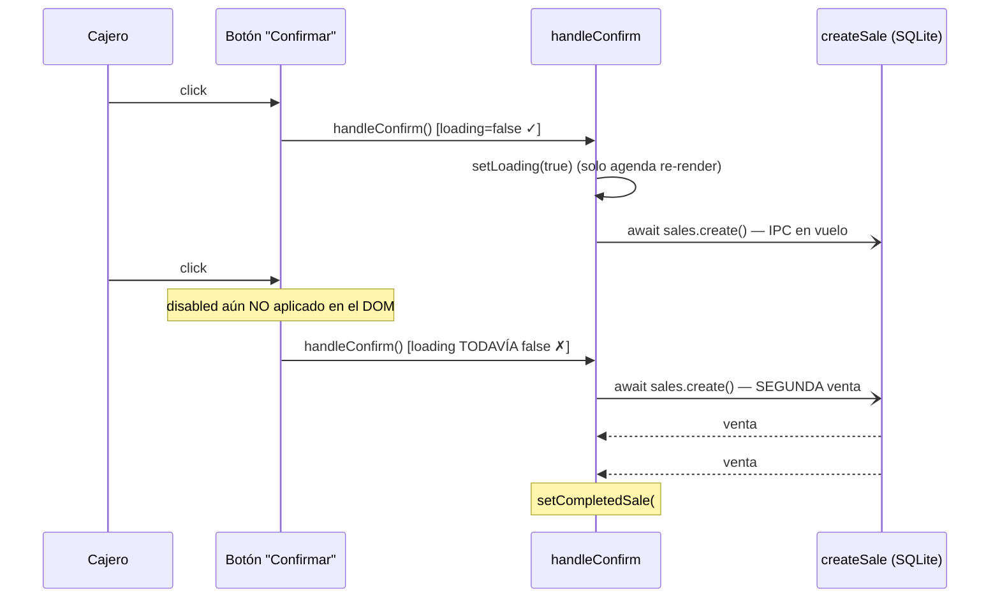
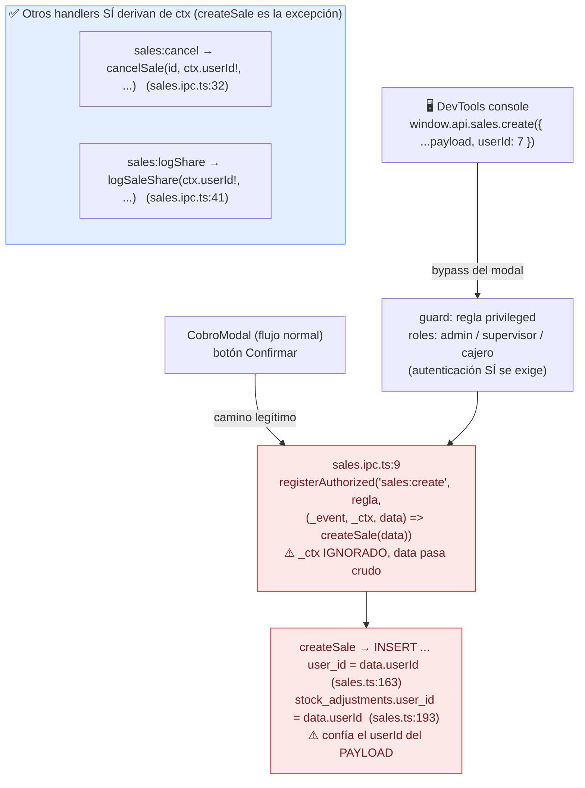
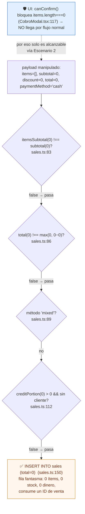

# Registro prematuro / duplicado de ventas — 3 escenarios

> Documento de diagnóstico (2026-06-26). Responde: "¿hay algún escenario donde se
> pueda registrar una venta sin terminar el flujo de cobro?". Auditoría
> multi-agente sobre el código real (`CobroModal.tsx`, `VentasPage.tsx`,
> `sales.ts`, `sales.ipc.ts`), con verificación adversarial del hallazgo
> principal (doble-submit).
>
> _Nota: queda en español por ser material de soporte; el resto de `docs/` está
> en inglés. Hermano del análisis [`cierre-de-caja-analisis.md`](./cierre-de-caja-analisis.md)._

---

## Contexto: el flujo está bien cerrado salvo por estos 3 huecos

El **único** call-site productivo de `window.api.sales.create` es
[`CobroModal.tsx:173`](../src/renderer/src/modules/ventas/CobroModal.tsx#L173),
detrás del botón explícito "Confirmar y Cobrar". Se verificaron y **descartaron**
como vías de registro prematuro: F12 y el botón "Cobrar" (solo *abren* el modal),
el scanner / Enter / báscula (solo agregan al carrito y se desactivan con el modal
abierto), los tickets en espera (solo mueven el carrito), el `onSuccess` post-venta
(solo limpia), y la atomicidad de `createSale` (todo dentro de una
`db.transaction()` → rollback total ante cualquier throw).

Quedan **3 escenarios** que sí pueden registrar una venta sin completar el flujo
previsto.

| # | Escenario | Vía | Severidad | Prob. | Fix mínimo |
|---|---|---|:---:|:---:|---|
| 1 | Doble-submit | Flujo normal (UI) | **Alta** | Ocasional | `useRef` síncrono en `handleConfirm` |
| 2 | Out-of-band + `userId` del payload | DevTools | Media | Rara | Usar `ctx.userId` en `sales.ipc.ts:9` |
| 3 | Venta vacía / total 0 | DevTools (sub-caso de #2) | Baja | Rara | Guard `items.length>0 && total>0` |

---

## Escenario 1 — Doble-submit (severidad ALTA)

**Qué es:** el cajero confirma dos veces en la misma ráfaga (doble-click, doble-tap
táctil, o click + Enter con el botón enfocado) y se crean **dos ventas** de un solo
carrito.

### Gráfico — la ventana de carrera

```
  t=0ms        t=8ms                       t≈50ms (IPC resuelve)
   │            │                             │
 click#1      click#2                         │
   │            │                             │
   ▼            ▼                             ▼
┌─────────────────────────────────────────────────────────────┐
│ VENTANA VULNERABLE: disabled={loading} todavía NO está en el │
│ DOM porque React aún no hizo commit del re-render            │
└─────────────────────────────────────────────────────────────┘
   │            │
   │            └─► handleConfirm() ② → loading sigue false → PASA → sales.create() ②
   │
   └─────────────► handleConfirm() ① → setLoading(true) [agenda render] → sales.create() ①
                                          ▲
                                          └── el re-render que pinta disabled=true
                                              llega DESPUÉS → demasiado tarde
```

### Gráfico — secuencia



### Por qué pasa (código exacto)

- [`CobroModal.tsx:130-132`](../src/renderer/src/modules/ventas/CobroModal.tsx#L130):
  `handleConfirm` abre con `if (!user || !register) return` → `setLoading(true)`.
  **No hay** `if (loading) return` ni `useRef` en vuelo.
- [`CobroModal.tsx:238`](../src/renderer/src/modules/ventas/CobroModal.tsx#L238):
  la única defensa es `disabled={loading || !canConfirm()}` — un atributo
  **renderizado** que React aplica en el siguiente commit, no de forma síncrona.
- [`CobroModal.tsx:173`](../src/renderer/src/modules/ventas/CobroModal.tsx#L173):
  el `await sales.create()` agrega latencia; el swap a `TicketPreviewModal`
  ([`:188`](../src/renderer/src/modules/ventas/CobroModal.tsx#L188)) que desmonta
  el botón ocurre **después** del await.
- **Servidor sin red:** [`sales.ts:66`](../src/main/db/queries/sales.ts#L66) cada
  llamada es su propia `db.transaction()` (atómica, pero independiente);
  [`sales.ts:150-172`](../src/main/db/queries/sales.ts#L150) `INSERT` con
  `lastInsertRowid` — **sin token de idempotencia ni índice UNIQUE**. Dos llamadas
  → dos filas.

### Impacto

Dos filas en `sales`, **doble decremento de stock**
([`sales.ts:179`](../src/main/db/queries/sales.ts#L179) — además sin
`WHERE stock >= ?`, el stock puede quedar negativo), y para crédito/mixto **doble
débito de fiado** ([`sales.ts:213`](../src/main/db/queries/sales.ts#L213) /
[`:221`](../src/main/db/queries/sales.ts#L221)). El segundo `created` sobreescribe
`completedSale`, así que **el duplicado es invisible** → descuadra arqueo, stock y
balance del cliente.

### Verificación adversarial

El pase adversarial intentó **refutar** el hueco buscando una barrera síncrona que
impida la segunda llamada y **no encontró ninguna** (confianza alta). Matiz honesto:
React 19 hace commit síncrono entre tareas de click *separadas*, lo que cierra el
doble-click secuencial puro; sobreviven la interleaving teclado+puntero en la misma
activación y el doble-tap táctil sub-frame → probabilidad **ocasional/baja**, pero
impacto **alto y silencioso**.

### Fix mínimo

```tsx
const submittingRef = useRef(false)            // junto a los demás hooks

const handleConfirm = async (): Promise<void> => {
  if (submittingRef.current || !user || !register) return
  submittingRef.current = true
  setLoading(true)
  try {
    // ... cuerpo actual ...
  } finally {
    setLoading(false)
    submittingRef.current = false
  }
}
```

El ref muta en el mismo tick síncrono, así que un segundo click en la misma ráfaga
ve `submittingRef.current === true` y aborta **antes** de llegar a
`window.api.sales.create`.

---

## Escenario 2 — Llamada out-of-band + `userId` del payload (severidad MEDIA)

**Qué es:** un usuario autenticado abre DevTools y llama `window.api.sales.create(...)`
directamente, **salteándose el modal y el carrito**. Peor: puede poner cualquier
`userId` y el servidor lo cree (forja de atribución/comisión/auditoría).

### Gráfico



### Por qué pasa (código exacto)

- [`sales.ipc.ts:9-11`](../src/main/ipc/sales.ipc.ts#L9):
  `(_event, _ctx, data) => salesQuery.createSale(data)` — el `_ctx` (identidad real
  del emisor) **se descarta** y `data` se reenvía tal cual.
- [`sales.ts:163`](../src/main/db/queries/sales.ts#L163): el `INSERT` usa
  `data.userId` (del payload), no la identidad de sesión.
- **Contraste:** [`sales.ipc.ts:32`](../src/main/ipc/sales.ipc.ts#L32) (`cancel`) y
  [`sales.ipc.ts:41`](../src/main/ipc/sales.ipc.ts#L41) (`logShare`) **sí** usan
  `ctx.userId!`. `create` es el único inconsistente.

### Impacto y matiz

La autenticación **sí** se exige (hay que estar logueado como admin/supervisor/cajero),
y los guards de caja-abierta ([`sales.ts:74`](../src/main/db/queries/sales.ts#L74)) y
consistencia de totales ([`sales.ts:83-94`](../src/main/db/queries/sales.ts#L83))
**siguen aplicando** — no se puede inyectar una venta con montos inconsistentes. Pero
**sí** se puede autorla saltándose el carrito y atribuírsela a **otro cajero**.
Coincide con la recomendación **#10** de
[`cierre-de-caja-analisis.md`](./cierre-de-caja-analisis.md) ("derivar `userId` de
`ctx.userId`, no del payload"). Probabilidad **rara** (requiere intención + DevTools),
fix de 1 línea.

---

## Escenario 3 — Venta vacía / total 0 (severidad BAJA)

**Qué es:** una venta con `items=[]` y `total=0` pasa **todas** las validaciones del
servidor y crea una fila fantasma. Solo alcanzable out-of-band (la UI lo bloquea), así
que es un sub-caso del Escenario 2.

### Gráfico



### Por qué pasa

Con `items=[]`: `itemsSubtotal = 0`, así que
[`sales.ts:83`](../src/main/db/queries/sales.ts#L83) (`0 !== 0` = false) pasa;
[`sales.ts:86`](../src/main/db/queries/sales.ts#L86) (`0 !== max(0, 0-0)` = false)
pasa; no es mixto; `creditPortion = 0` → no exige cliente
([`sales.ts:112`](../src/main/db/queries/sales.ts#L112)). **No existe** un guard
`data.items.length > 0` ni `data.total > 0`. El loop de ítems
([`sales.ts:187`](../src/main/db/queries/sales.ts#L187)) no itera → sin stock, sin
pagos.

### Impacto

Bajo: fila basura sin dinero ni stock, pero consume un número de venta y ensucia
reportes/conteos. La UI lo bloquea
([`CobroModal.tsx:117`](../src/renderer/src/modules/ventas/CobroModal.tsx#L117)), así
que **solo** se alcanza por el vector del Escenario 2.

---

## Conclusión

El **único accionable desde el uso real** (sin manipulación) es el **#1
(doble-submit)** — severidad alta, fix trivial de ~3 líneas. Los **#2 y #3**
requieren DevTools + intención, pero son hardening barato y se alinean con el doc de
cierre de caja.

**Fix recomendado en un solo cambio acotado:**

1. `useRef` síncrono en `handleConfirm` (`CobroModal.tsx`) — cierra #1.
2. Derivar `userId` de `ctx.userId` en `sales.ipc.ts:9` — cierra #2.
3. Guard `items.length > 0 && total > 0` al inicio de `createSale` (`sales.ts`) — cierra #3.

Defensa en profundidad opcional para #1: clave de idempotencia generada por el cliente
(`crypto.randomUUID()` por intento) + columna `client_token` con índice UNIQUE en
`sales`, devolviendo la venta existente ante violación.

---

_Análisis generado con auditoría multi-agente y verificación adversarial sobre el
código real._
