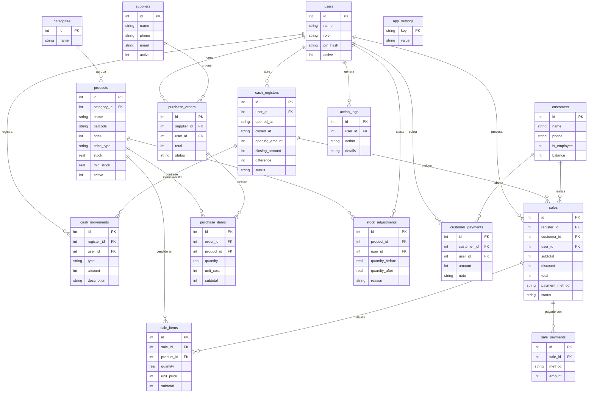

# Especificación Técnica — Sistema POS Multicarnes
**Versión:** 1.0  
**Fecha:** Abril 2026  
**Cliente:** Multicarnes S.R.L., Encarnación, Paraguay  
**Desarrollador:** Julio Noguera  

---

## 1. Stack tecnológico

| Capa | Tecnología | Versión |
|---|---|---|
| Framework desktop | Electron | 33.x |
| Frontend | React | 18.x |
| Lenguaje | TypeScript | 5.x |
| Bundler | Vite (via electron-vite) | latest |
| Base de datos | SQLite (better-sqlite3) | latest |
| Estado global | Zustand | 4.x |
| Estilos | Tailwind CSS + shadcn/ui | latest |
| Routing | React Router DOM | 6.x |
| Impresión térmica | node-thermal-printer | latest |
| Exportación | xlsx + jsPDF | latest |
| Seguridad (PIN) | bcryptjs | latest |
| Fechas | date-fns | latest |
| Empaquetado | electron-builder | latest |
| Moneda | Guaraníes (Gs.) — sin decimales |

### Paleta de colores (identidad visual de Multicarnes S.R.L.)

| Token | Hex | Uso |
|---|---|---|
| `--color-brand` | `#CC1C1C` | Sidebar, header, botones primarios (Cobrar, Guardar) |
| `--color-brand-hover` | `#AA1515` | Estado hover de botones primarios |
| `--color-brand-light` | `#F9E8E8` | Fondos de alertas, badges de estado |
| `--color-bg-primary` | `#FFFFFF` | Fondo principal de pantallas |
| `--color-bg-secondary` | `#F5F0F0` | Cards, filas alternas, inputs |
| `--color-text-main` | `#1A1A1A` | Texto principal, íconos |
| `--color-text-muted` | `#6B6B6B` | Labels, placeholders, subtítulos |

En `tailwind.config.ts` extender así:
```ts
theme: {
  extend: {
    colors: {
      brand: {
        DEFAULT: '#CC1C1C',
        hover:   '#AA1515',
        light:   '#F9E8E8',
      },
    },
  },
},
```

### Inicialización del proyecto
```bash
npm create @quick-start/electron pos-multicarnes -- --template react-ts
cd pos-multicarnes
npm install
```

### Estructura de carpetas
```
pos-multicarnes/
├── src/
│   ├── main/                  # Proceso principal Electron (Node.js)
│   │   ├── index.ts           # Entry point
│   │   ├── db/
│   │   │   ├── schema.ts      # Definición de tablas SQLite
│   │   │   ├── seed.ts        # Datos iniciales
│   │   │   └── queries/       # Queries por módulo
│   │   │       ├── products.ts
│   │   │       ├── sales.ts
│   │   │       ├── customers.ts
│   │   │       ├── purchases.ts
│   │   │       ├── cash.ts
│   │   │       ├── users.ts
│   │   │       └── reports.ts
│   │   ├── ipc/               # Handlers IPC (comunicación main↔renderer)
│   │   │   ├── products.ipc.ts
│   │   │   ├── sales.ipc.ts
│   │   │   ├── customers.ipc.ts
│   │   │   ├── purchases.ipc.ts
│   │   │   ├── cash.ipc.ts
│   │   │   ├── users.ipc.ts
│   │   │   ├── reports.ipc.ts
│   │   │   └── backup.ipc.ts
│   │   └── services/
│   │       ├── printer.ts     # Impresora térmica
│   │       └── backup.ts      # Copia de seguridad
│   ├── preload/
│   │   └── index.ts           # Bridge seguro main↔renderer
│   └── renderer/              # Aplicación React
│       ├── main.tsx
│       ├── App.tsx
│       ├── router.tsx
│       ├── store/             # Zustand stores
│       │   ├── auth.store.ts
│       │   ├── cart.store.ts
│       │   └── cash.store.ts
│       ├── components/        # Componentes reutilizables
│       │   ├── Layout.tsx
│       │   ├── Sidebar.tsx
│       │   ├── CurrencyInput.tsx
│       │   ├── ProductSearch.tsx
│       │   ├── ConfirmDialog.tsx
│       │   └── PrintButton.tsx
│       └── modules/           # Módulos de la app
│           ├── login/
│           ├── dashboard/
│           ├── caja/
│           ├── ventas/
│           ├── productos/
│           ├── compras/
│           ├── clientes/
│           ├── reportes/
│           └── usuarios/
├── resources/
│   └── icon.ico
├── electron-builder.yml
└── electron.vite.config.ts
```

---

## 2. Base de datos — Esquema completo (SQLite)

> Todas las queries usan `better-sqlite3` de forma síncrona.  
> La DB se crea automáticamente en `app.getPath('userData')/pos.db` al primer inicio.  
> Moneda: enteros en guaraníes (sin centavos).

### 2.1 Tabla: `users`
```sql
CREATE TABLE IF NOT EXISTS users (
  id         INTEGER PRIMARY KEY AUTOINCREMENT,
  name       TEXT NOT NULL,
  role       TEXT NOT NULL CHECK(role IN ('admin','supervisor','cajero')),
  pin_hash   TEXT NOT NULL,
  active     INTEGER NOT NULL DEFAULT 1,
  created_at TEXT NOT NULL DEFAULT (datetime('now','localtime'))
);
```

### 2.2 Tabla: `categories`
```sql
CREATE TABLE IF NOT EXISTS categories (
  id   INTEGER PRIMARY KEY AUTOINCREMENT,
  name TEXT NOT NULL UNIQUE
);
```

### 2.3 Tabla: `products`
```sql
CREATE TABLE IF NOT EXISTS products (
  id          INTEGER PRIMARY KEY AUTOINCREMENT,
  category_id INTEGER REFERENCES categories(id),
  name        TEXT NOT NULL,
  barcode     TEXT UNIQUE,
  price       INTEGER NOT NULL DEFAULT 0,  -- en Gs.
  price_type  TEXT NOT NULL DEFAULT 'unit' CHECK(price_type IN ('unit','kg')),
  stock       REAL NOT NULL DEFAULT 0,     -- REAL para permitir kg fraccionados
  min_stock   REAL NOT NULL DEFAULT 0,
  active      INTEGER NOT NULL DEFAULT 1,
  created_at  TEXT NOT NULL DEFAULT (datetime('now','localtime')),
  updated_at  TEXT NOT NULL DEFAULT (datetime('now','localtime'))
);
```

### 2.4 Tabla: `customers`
```sql
CREATE TABLE IF NOT EXISTS customers (
  id          INTEGER PRIMARY KEY AUTOINCREMENT,
  name        TEXT NOT NULL,
  phone       TEXT,
  address     TEXT,
  is_employee INTEGER NOT NULL DEFAULT 0,
  balance     INTEGER NOT NULL DEFAULT 0,  -- negativo = debe al negocio
  created_at  TEXT NOT NULL DEFAULT (datetime('now','localtime'))
);
```

### 2.5 Tabla: `suppliers`
```sql
CREATE TABLE IF NOT EXISTS suppliers (
  id         INTEGER PRIMARY KEY AUTOINCREMENT,
  name       TEXT NOT NULL,
  phone      TEXT,
  email      TEXT,
  address    TEXT,
  active     INTEGER NOT NULL DEFAULT 1,
  created_at TEXT NOT NULL DEFAULT (datetime('now','localtime'))
);
```

### 2.6 Tabla: `cash_registers` (sesiones de caja)
```sql
CREATE TABLE IF NOT EXISTS cash_registers (
  id             INTEGER PRIMARY KEY AUTOINCREMENT,
  user_id        INTEGER NOT NULL REFERENCES users(id),
  opened_at      TEXT NOT NULL DEFAULT (datetime('now','localtime')),
  closed_at      TEXT,
  opening_amount INTEGER NOT NULL DEFAULT 0,
  closing_amount INTEGER,
  expected_amount INTEGER,
  difference     INTEGER,
  notes          TEXT,
  status         TEXT NOT NULL DEFAULT 'open' CHECK(status IN ('open','closed'))
);
```

### 2.7 Tabla: `cash_movements` (ingresos/egresos manuales)
```sql
CREATE TABLE IF NOT EXISTS cash_movements (
  id          INTEGER PRIMARY KEY AUTOINCREMENT,
  register_id INTEGER NOT NULL REFERENCES cash_registers(id),
  user_id     INTEGER NOT NULL REFERENCES users(id),
  type        TEXT NOT NULL CHECK(type IN ('income','expense')),
  amount      INTEGER NOT NULL,
  description TEXT NOT NULL,
  created_at  TEXT NOT NULL DEFAULT (datetime('now','localtime'))
);
```

### 2.8 Tabla: `sales`
```sql
CREATE TABLE IF NOT EXISTS sales (
  id             INTEGER PRIMARY KEY AUTOINCREMENT,
  register_id    INTEGER NOT NULL REFERENCES cash_registers(id),
  customer_id    INTEGER REFERENCES customers(id),
  user_id        INTEGER NOT NULL REFERENCES users(id),
  subtotal       INTEGER NOT NULL,
  discount       INTEGER NOT NULL DEFAULT 0,
  total          INTEGER NOT NULL,
  payment_method TEXT NOT NULL CHECK(payment_method IN ('cash','credit','transfer','mixed')),
  status         TEXT NOT NULL DEFAULT 'completed' CHECK(status IN ('completed','cancelled')),
  notes          TEXT,
  created_at     TEXT NOT NULL DEFAULT (datetime('now','localtime'))
);
```

### 2.9 Tabla: `sale_items`
```sql
CREATE TABLE IF NOT EXISTS sale_items (
  id         INTEGER PRIMARY KEY AUTOINCREMENT,
  sale_id    INTEGER NOT NULL REFERENCES sales(id),
  product_id INTEGER NOT NULL REFERENCES products(id),
  quantity   REAL NOT NULL,
  unit_price INTEGER NOT NULL,
  subtotal   INTEGER NOT NULL
);
```

### 2.10 Tabla: `sale_payments` (para pagos mixtos)
```sql
CREATE TABLE IF NOT EXISTS sale_payments (
  id      INTEGER PRIMARY KEY AUTOINCREMENT,
  sale_id INTEGER NOT NULL REFERENCES sales(id),
  method  TEXT NOT NULL CHECK(method IN ('cash','credit','transfer')),
  amount  INTEGER NOT NULL
);
```

### 2.11 Tabla: `purchase_orders`
```sql
CREATE TABLE IF NOT EXISTS purchase_orders (
  id          INTEGER PRIMARY KEY AUTOINCREMENT,
  supplier_id INTEGER REFERENCES suppliers(id),
  user_id     INTEGER NOT NULL REFERENCES users(id),
  total       INTEGER NOT NULL DEFAULT 0,
  status      TEXT NOT NULL DEFAULT 'pending' CHECK(status IN ('pending','received','cancelled')),
  notes       TEXT,
  created_at  TEXT NOT NULL DEFAULT (datetime('now','localtime')),
  received_at TEXT
);
```

### 2.12 Tabla: `purchase_items`
```sql
CREATE TABLE IF NOT EXISTS purchase_items (
  id         INTEGER PRIMARY KEY AUTOINCREMENT,
  order_id   INTEGER NOT NULL REFERENCES purchase_orders(id),
  product_id INTEGER NOT NULL REFERENCES products(id),
  quantity   REAL NOT NULL,
  unit_cost  INTEGER NOT NULL,
  subtotal   INTEGER NOT NULL
);
```

### 2.13 Tabla: `stock_adjustments`
```sql
CREATE TABLE IF NOT EXISTS stock_adjustments (
  id               INTEGER PRIMARY KEY AUTOINCREMENT,
  product_id       INTEGER NOT NULL REFERENCES products(id),
  user_id          INTEGER NOT NULL REFERENCES users(id),
  quantity_before  REAL NOT NULL,
  quantity_after   REAL NOT NULL,
  reason           TEXT NOT NULL,
  created_at       TEXT NOT NULL DEFAULT (datetime('now','localtime'))
);
```

### 2.14 Tabla: `customer_payments` (pagos de fiado)
```sql
CREATE TABLE IF NOT EXISTS customer_payments (
  id          INTEGER PRIMARY KEY AUTOINCREMENT,
  customer_id INTEGER NOT NULL REFERENCES customers(id),
  user_id     INTEGER NOT NULL REFERENCES users(id),
  amount      INTEGER NOT NULL,
  note        TEXT,
  created_at  TEXT NOT NULL DEFAULT (datetime('now','localtime'))
);
```

### 2.15 Tabla: `action_logs`
```sql
CREATE TABLE IF NOT EXISTS action_logs (
  id         INTEGER PRIMARY KEY AUTOINCREMENT,
  user_id    INTEGER REFERENCES users(id),
  action     TEXT NOT NULL,
  details    TEXT,
  created_at TEXT NOT NULL DEFAULT (datetime('now','localtime'))
);
```

### 2.16 Tabla: `app_settings`
```sql
CREATE TABLE IF NOT EXISTS app_settings (
  key   TEXT PRIMARY KEY,
  value TEXT NOT NULL
);
-- Valores iniciales:
-- business_name = 'Multicarnes S.R.L.'
-- business_address = 'Encarnación, Paraguay'
-- business_phone = ''
-- thermal_printer_name = ''
-- thermal_printer_width = '80'  -- 58 o 80 mm
-- backup_path = ''
-- auto_backup = '1'
```

---

## 3. Diagrama de base de datos (ERD)



---

## 4. Módulos — Vistas y reglas de negocio

### 3.1 Login

**Ruta:** `/login`  
**Acceso:** Todos los roles  

**Vista:**
- Logo del negocio centrado
- Lista de usuarios activos como botones/cards con nombre e ícono de avatar
- Al seleccionar un usuario → input numérico de PIN (4-6 dígitos)
- Botón "Ingresar"
- Mensaje de error si PIN incorrecto

**Reglas:**
- PIN se valida con bcryptjs contra `pin_hash` en la DB
- Al autenticarse se guarda `{ id, name, role }` en Zustand `auth.store`
- Si no hay caja abierta y el rol es cajero/supervisor → redirigir a apertura de caja
- Admin puede ingresar sin caja abierta

---

### 3.2 Dashboard

**Ruta:** `/dashboard`  
**Acceso:** Todos los roles  

**Vista:**
- Barra lateral (Sidebar) con navegación a todos los módulos
- Cards de resumen del día:
  - Total vendido (suma de `sales.total` del día)
  - Cantidad de ventas
  - Efectivo en caja estimado
  - Alertas de stock mínimo (productos con `stock <= min_stock`)
- Acceso rápido a "Nueva venta" (botón grande)

---

### 3.3 Módulo: Caja

**Ruta base:** `/caja`  
**Acceso:** Admin, Supervisor, Cajero  

#### 3.3.1 Vista: Apertura de caja (`/caja/apertura`)
- Input: monto de apertura en Gs.
- Botón "Abrir caja"
- Crea registro en `cash_registers` con `status = 'open'`
- Guarda `register_id` en Zustand `cash.store`
- Solo puede haber una caja abierta a la vez

#### 3.3.2 Vista: Caja actual (`/caja`)
- Muestra estado actual:
  - Monto de apertura
  - Total ventas en efectivo del turno
  - Total ingresos manuales
  - Total egresos manuales
  - **Efectivo esperado** = apertura + ventas efectivo + ingresos - egresos
- Botón "Registrar ingreso" → modal con descripción + monto
- Botón "Registrar egreso" → modal con descripción + monto
- Lista de movimientos del turno (tabla scrolleable)
- Botón "Cerrar caja" (solo Admin/Supervisor)

#### 3.3.3 Vista: Cierre de caja / Arqueo (`/caja/cierre`)
- Input: monto contado físicamente
- Muestra diferencia (contado - esperado)
- Campo de notas
- Botón "Confirmar cierre"
- Actualiza `cash_registers` con `closed_at`, `closing_amount`, `expected_amount`, `difference`, `status = 'closed'`
- Genera resumen imprimible del turno

#### 3.3.4 Resumen del día
- Disponible desde el Dashboard
- Total por método de pago (efectivo, transferencia, fiado)
- Detalle de movimientos manuales

---

### 3.4 Módulo: Ventas (POS)

**Ruta:** `/ventas`  
**Acceso:** Admin, Supervisor, Cajero  
**Requiere:** Caja abierta  

**Vista principal (pantalla dividida):**

**Panel izquierdo — Carrito:**
- Lista de items agregados (nombre, cantidad, precio unitario, subtotal)
- Input de cantidad editable inline
- Botón para eliminar item
- Sección de descuento (monto fijo en Gs.)
- Subtotal, Descuento, Total en grande
- Botón "Cancelar venta"
- Botón "Cobrar" (CTA principal)

**Panel derecho — Búsqueda de productos:**
- Input de búsqueda (por nombre o código de barras)
- Grid de productos encontrados con: nombre, precio, stock
- Click en producto → abre modal de cantidad
- Soporte de lector de código de barras (captura keydown en el input)

**Modal: Ingresar cantidad**
- Nombre del producto
- Input numérico de cantidad
- Si `price_type = 'kg'`: label "kg", permite decimales (ej: 0.750)
- Si `price_type = 'unit'`: label "unidades", solo enteros
- Muestra precio total calculado en tiempo real
- Botón "Agregar al carrito"

**Modal: Cobro**
- Total a cobrar en grande
- Selección de cliente (opcional, búsqueda por nombre)
- Método de pago:
  - **Efectivo**: input de monto recibido → calcula vuelto
  - **Transferencia**: solo confirmar
  - **Fiado**: requiere cliente seleccionado, suma al `balance` del cliente
  - **Mixto**: permite ingresar montos por cada método, valida que sumen el total
- Botón "Confirmar y cobrar"
- Al confirmar: crea `sales`, `sale_items`, `sale_payments`, descuenta stock, actualiza `balance` si es fiado
- Muestra modal de éxito con opción de imprimir ticket

**Reglas de negocio:**
- No se puede vender si stock = 0 (salvo que Admin lo permita en settings)
- Fiado solo disponible si hay cliente seleccionado
- Descuento no puede superar el subtotal
- El vuelto se calcula como `efectivo_recibido - total`

---

### 3.5 Módulo: Productos & Stock

**Ruta base:** `/productos`  
**Acceso:** Admin, Supervisor  

#### 3.5.1 Lista de productos (`/productos`)
- Tabla con columnas: Nombre, Categoría, Precio, Tipo, Stock, Stock mín., Estado
- Filtros: por categoría, por estado (activo/inactivo), por stock bajo
- Buscador por nombre
- Botón "Nuevo producto"
- Botón "Ajustar stock" por fila
- Botón "Editar" por fila
- Indicador visual (ícono rojo) si `stock <= min_stock`

#### 3.5.2 Crear/Editar producto (`/productos/nuevo` y `/productos/:id`)
**Campos:**
- Nombre (requerido)
- Categoría (selector con opción de crear nueva)
- Código de barras (opcional, único)
- Precio en Gs. (requerido)
- Tipo de precio: "Por kg" / "Por unidad"
- Stock inicial
- Stock mínimo (para alertas)
- Estado: activo / inactivo

#### 3.5.3 Modal: Ajuste de stock
- Nombre del producto
- Stock actual (solo lectura)
- Input: nuevo stock
- Diferencia calculada automáticamente
- Campo: motivo del ajuste (requerido)
- Crea registro en `stock_adjustments`

---

### 3.6 Módulo: Compras & Proveedores

**Ruta base:** `/compras`  
**Acceso:** Admin, Supervisor  

#### 3.6.1 Lista de proveedores (`/compras/proveedores`)
- Tabla: Nombre, Teléfono, Email
- Botón "Nuevo proveedor"
- Botón "Ver historial" por fila

#### 3.6.2 Crear/Editar proveedor
**Campos:** Nombre, Teléfono, Email, Dirección, Activo

#### 3.6.3 Lista de órdenes de compra (`/compras`)
- Tabla: Fecha, Proveedor, Total, Estado, Acciones
- Filtro por estado (pendiente / recibido / cancelado)
- Botón "Nueva orden"

#### 3.6.4 Nueva orden de compra (`/compras/nueva`)
- Selector de proveedor
- Tabla de items:
  - Búsqueda de producto
  - Cantidad
  - Costo unitario (Gs.)
  - Subtotal calculado
  - Botón eliminar fila
- Total de la orden
- Notas (opcional)
- Botón "Guardar como pendiente"
- Botón "Guardar y recibir mercadería"
  - Si se recibe: suma cantidades a `products.stock`, crea registro en `purchase_orders` con `status = 'received'`

#### 3.6.5 Ver orden existente (`/compras/:id`)
- Detalle de la orden
- Si está pendiente: botón "Marcar como recibida"
- Si está pendiente: botón "Cancelar orden"
- Historial de precios de compra por producto (lista de `purchase_items` del mismo producto)

---

### 3.7 Módulo: Clientes

**Ruta base:** `/clientes`  
**Acceso:** Admin, Supervisor  

#### 3.7.1 Lista de clientes (`/clientes`)
- Tabla: Nombre, Teléfono, Saldo (balance), Empleado
- Buscador por nombre
- Color rojo en saldo si negativo (cliente debe)
- Botón "Nuevo cliente"
- Botón "Ver ficha" por fila

#### 3.7.2 Crear/Editar cliente
**Campos:** Nombre (requerido), Teléfono, Dirección, Es empleado (checkbox)

#### 3.7.3 Ficha de cliente (`/clientes/:id`)
- Datos del cliente
- Saldo actual (balance)
- Botón "Registrar pago" (abona deuda)
  - Modal: input monto, nota opcional
  - Crea `customer_payments`, suma al `balance`
- Historial de compras (tabla de `sales` del cliente, paginada)
- Historial de pagos (`customer_payments`)

---

### 3.8 Módulo: Reportes

**Ruta base:** `/reportes`  
**Acceso:** Admin, Supervisor  

#### 3.8.1 Ventas por período (`/reportes/ventas`)
- Filtros: fecha desde, fecha hasta, método de pago, usuario
- Tabla: Fecha, N° venta, Cliente, Total, Método, Usuario
- Totales al pie: suma total, cantidad de ventas
- Botón "Exportar a Excel"
- Botón "Exportar a PDF"

#### 3.8.2 Productos más vendidos (`/reportes/productos`)
- Filtros: fecha desde, fecha hasta, categoría
- Tabla: Producto, Categoría, Cantidad vendida, Total recaudado
- Ordenable por columna

#### 3.8.3 Margen de ganancia (`/reportes/margen`)
- Cruza precio de venta vs último costo de compra
- Tabla: Producto, Precio venta, Último costo, Margen (Gs.), Margen (%)

#### 3.8.4 Movimientos de stock (`/reportes/stock`)
- Filtros: fecha, producto
- Tabla: Fecha, Producto, Tipo (venta/compra/ajuste), Cantidad antes, Cantidad después, Motivo, Usuario

#### 3.8.5 Resumen de caja por turno (`/reportes/caja`)
- Lista de cierres de caja anteriores
- Al hacer click: detalle completo del turno (ventas, movimientos, diferencia de arqueo)

---

### 3.9 Módulo: Usuarios & Seguridad

**Ruta base:** `/usuarios`  
**Acceso:** Solo Admin  

#### 3.9.1 Lista de usuarios (`/usuarios`)
- Tabla: Nombre, Rol, Estado
- Botón "Nuevo usuario"
- Botón "Editar" por fila

#### 3.9.2 Crear/Editar usuario
**Campos:**
- Nombre completo (requerido)
- Rol: Admin / Supervisor / Cajero
- PIN (4-6 dígitos, requerido al crear, opcional al editar = no cambia)
- Confirmar PIN
- Activo (checkbox)
- PIN se almacena hasheado con bcryptjs (saltRounds: 10)

#### 3.9.3 Roles y permisos

| Módulo | Admin | Supervisor | Cajero |
|---|---|---|---|
| Login | ✓ | ✓ | ✓ |
| Dashboard | ✓ | ✓ | ✓ |
| Caja | ✓ | ✓ | ✓ (abrir/ver) |
| Cierre de caja | ✓ | ✓ | ✗ |
| Ventas | ✓ | ✓ | ✓ |
| Productos (ver) | ✓ | ✓ | ✓ |
| Productos (editar) | ✓ | ✓ | ✗ |
| Compras | ✓ | ✓ | ✗ |
| Clientes | ✓ | ✓ | ✗ |
| Reportes | ✓ | ✓ | ✗ |
| Usuarios | ✓ | ✗ | ✗ |
| Configuración | ✓ | ✗ | ✗ |

---

### 3.10 Módulo: Configuración & Backup

**Ruta base:** `/configuracion`  
**Acceso:** Solo Admin  

**Vista:**
- Datos del negocio: nombre, dirección, teléfono (usado en tickets)
- Impresora térmica: nombre del puerto o impresora, ancho (58mm / 80mm), botón "Imprimir prueba"
- Backup automático: toggle ON/OFF, selector de carpeta destino
- Botón "Hacer backup ahora" → copia `pos.db` a la carpeta con timestamp
- Botón "Restaurar backup" → selector de archivo `.db`
- Historial de backups (lista de archivos en la carpeta configurada)

---

## 4. Impresión de ticket térmico

**Librería:** `node-thermal-printer`  
**Se ejecuta desde el proceso main via IPC**

### Estructura del ticket:
```
==============================
     MULTICARNES S.R.L.
   Encarnación, Paraguay
   Tel: 0971-000000
==============================
Ticket N°: 0001234
Fecha: 21/04/2026  14:35
Cajero: Juan Pérez
==============================
PRODUCTO          CANT  TOTAL
------------------------------
Asado kg           1.5  45.000
Milanesa c/u         2  30.000
------------------------------
SUBTOTAL:          Gs. 75.000
DESCUENTO:          Gs. 5.000
TOTAL:             Gs. 70.000
------------------------------
EFECTIVO:          Gs. 80.000
VUELTO:            Gs. 10.000
==============================
    ¡Gracias por su compra!
==============================
```

---

## 5. Backup automático

- Cada vez que se cierra una caja → copia automática de `pos.db`
- Nombre del archivo: `backup_YYYY-MM-DD_HH-mm-ss.db`
- Destino: carpeta configurada en settings (por defecto, subcarpeta `backups/` en userData)
- Si hay USB conectado y la carpeta backup apunta al USB → copia al USB automáticamente
- El proceso main es responsable del backup (nunca el renderer)

---

## 6. Comunicación IPC (main ↔ renderer)

Todos los canales siguen el patrón `modulo:accion`.

### Ejemplos de canales:
```typescript
// Productos
'products:getAll'         → { filters? } → Product[]
'products:getById'        → { id } → Product
'products:create'         → { data } → Product
'products:update'         → { id, data } → Product
'products:delete'         → { id } → void
'products:adjustStock'    → { id, newStock, reason } → void

// Ventas
'sales:create'            → { items, customerId, paymentMethod, payments, discount } → Sale
'sales:getRecent'         → { limit } → Sale[]
'sales:cancel'            → { id } → void

// Caja
'cash:open'               → { openingAmount } → CashRegister
'cash:close'              → { closingAmount, notes } → CashRegister
'cash:getCurrent'         → {} → CashRegister | null
'cash:addMovement'        → { type, amount, description } → CashMovement

// Clientes
'customers:getAll'        → {} → Customer[]
'customers:create'        → { data } → Customer
'customers:addPayment'    → { customerId, amount, note } → void

// Reportes
'reports:salesByPeriod'   → { from, to, method?, userId? } → SaleReport[]
'reports:topProducts'     → { from, to } → ProductReport[]
'reports:stockMovements'  → { from, to, productId? } → StockMovement[]

// Usuarios
'users:getAll'            → {} → User[]
'users:create'            → { data } → User
'users:login'             → { userId, pin } → User | null

// Impresora
'printer:printTicket'     → { saleId } → void
'printer:test'            → {} → void

// Backup
'backup:create'           → {} → string (path)
'backup:restore'          → { path } → void
'backup:list'             → {} → BackupFile[]
```

---

## 7. Tipos TypeScript compartidos (shared/types.ts)

```typescript
type Role = 'admin' | 'supervisor' | 'cajero';
type PriceType = 'unit' | 'kg';
type PaymentMethod = 'cash' | 'credit' | 'transfer' | 'mixed';
type SaleStatus = 'completed' | 'cancelled';
type OrderStatus = 'pending' | 'received' | 'cancelled';
type MovementType = 'income' | 'expense';

interface User {
  id: number;
  name: string;
  role: Role;
  active: boolean;
  created_at: string;
}

interface Product {
  id: number;
  category_id: number | null;
  category_name?: string;
  name: string;
  barcode: string | null;
  price: number;
  price_type: PriceType;
  stock: number;
  min_stock: number;
  active: boolean;
  low_stock?: boolean; // calculado: stock <= min_stock
}

interface Customer {
  id: number;
  name: string;
  phone: string | null;
  address: string | null;
  is_employee: boolean;
  balance: number;
}

interface Sale {
  id: number;
  register_id: number;
  customer_id: number | null;
  customer_name?: string;
  user_id: number;
  user_name?: string;
  subtotal: number;
  discount: number;
  total: number;
  payment_method: PaymentMethod;
  status: SaleStatus;
  items?: SaleItem[];
  created_at: string;
}

interface SaleItem {
  id: number;
  sale_id: number;
  product_id: number;
  product_name?: string;
  quantity: number;
  unit_price: number;
  subtotal: number;
}

interface CartItem {
  product: Product;
  quantity: number;
  subtotal: number;
}

interface CashRegister {
  id: number;
  user_id: number;
  opened_at: string;
  closed_at: string | null;
  opening_amount: number;
  closing_amount: number | null;
  expected_amount: number | null;
  difference: number | null;
  status: 'open' | 'closed';
}
```

---

## 8. Formato de moneda

- Guaraníes no tienen centavos → todos los valores son **enteros**
- Formato de visualización: `Gs. 1.250.000` (separador de miles con punto)
- Función helper:
```typescript
export function formatGs(amount: number): string {
  return `Gs. ${amount.toLocaleString('es-PY')}`;
}
```

---

## 9. Datos iniciales (seed)

Al primer inicio se insertan automáticamente:
- Usuario admin: nombre "Administrador", PIN: 1234 (el cliente debe cambiarlo)
- Categorías: "Vacuno", "Cerdo", "Pollo", "Embutidos", "Otros"
- Settings: nombre del negocio, etc.

---

## 10. Notas para el desarrollo

1. **Nunca** hacer queries SQLite desde el renderer. Todo va por IPC al proceso main.
2. Usar `contextBridge` en preload para exponer solo los canales necesarios.
3. El proceso main inicia la DB en `app.ready` antes de abrir ventanas.
4. `better-sqlite3` es síncrono — no usar async/await en queries.
5. Todas las operaciones de venta deben ser **transacciones SQL** para evitar inconsistencias.
6. El ID de caja abierta se guarda en Zustand y se re-verifica al inicio de cada sesión.
7. Para el lector de código de barras: capturar eventos `keydown` en el input de búsqueda con un timeout de 50ms (los lectores envían caracteres muy rápido seguidos de Enter).
8. En Mac durante desarrollo, la impresora térmica puede no estar disponible — el servicio debe manejar el error graciosamente y mostrar una notificación, sin romper el flujo de venta.